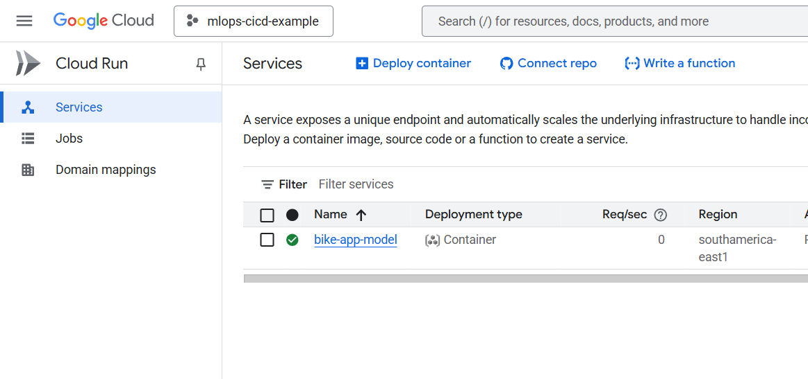

# mlops_cicd_example
Example of how to use google cloud platform services to deploy a machine learning project.

## Problem to solve:
Deploy the prediction serving application of a machine learning regresion model that predicts the count of rental bikes. It should be used into cloud run so that it can be used for online predictions by the business applications.

Data URL: https://archive.ics.uci.edu/dataset/275/bike+sharing+dataset

OBS: model will be developed locally.

## First Steps for creating environment
1. Create new project at GCP
2. Attach biiling configurations into your project
3. Download CLI from google: https://dl.google.com/dl/cloudsdk/channels/rapid/GoogleCloudSDKInstaller.exe?hl=pt-br
4. Connect to your project: gcloud config set project mlops-cicd-example

## Services:

    

